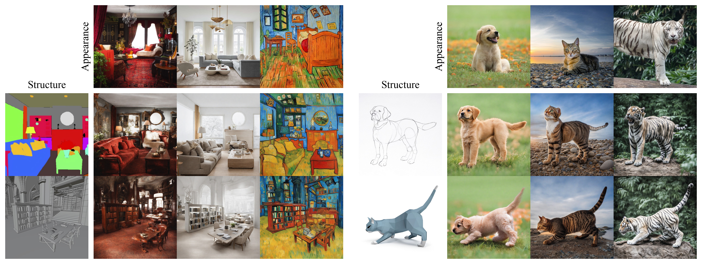

# Ctrl-X: Controlling Structure and Appearance for Text-To-Image Generation Without Guidance (NeurIPS 2024)

<a href="https://arxiv.org/abs/2406.07540"></a> 
<a href="https://genforce.github.io/ctrl-x"></a>
[](https://github.com/genforce/ctrl-x)

[Kuan Heng Lin](https://kuanhenglin.github.io)<sup>1*</sup>, [Sicheng Mo](https://sichengmo.github.io/)<sup>1*</sup>, [Ben Klingher](https://bklingher.github.io)<sup>1</sup>, [Fangzhou Mu](https://pages.cs.wisc.edu/~fmu/)<sup>2</sup>, [Bolei Zhou](https://boleizhou.github.io/)<sup>1</sup> <br>
<sup>1</sup>UCLA&emsp;<sup>2</sup>NVIDIA <br>
<sup>*</sup>Equal contribution <br>



## Getting started

### Environment setup

Our code is built on top of [`diffusers v0.28.0`](https://github.com/huggingface/diffusers). To set up the environment, please run the following.
```
conda env create -f environment.yaml
conda activate ctrlx
```

### Running Ctrl-X

#### Gradio demo

We provide a user interface for testing our method. Running the following command starts the demo.
```bash
python app_ctrlx.py
```

#### Script

We also provide a script for running our method. This is equivalent to the Gradio demo.
```bash
python run_ctrlx.py \
    --structure_image assets/images/horse__point_cloud.jpg \
    --appearance_image assets/images/horse.jpg \
    --prompt "a photo of a horse standing on grass" \
    --structure_prompt "a 3D point cloud of a horse"
```
If `appearance_image` is not provided, then Ctrl-X does *structure-only* control. If `structure_image` is not provided, then Ctrl-X does *appearance-only* control.

#### Optional arguments

There are three optional arguments for both `app_ctrlx.py` and `run_ctrlx.py`:
- `model_offload` (flag): If enabled, offloads each component of both the base model and refiner to the CPU when not in use, reducing memory usage while slightly increasing inference time.
    - To use `model_offload`, [`accelerate`](https://github.com/huggingface/accelerate) must be installed. This must be done manually with `pip install accelerate` as `environment.yaml` does *not* have `accelerate` listed.
- `sequential_offload` (flag): If enabled, offloads each layer of both the base model and refiner to the CPU when not in use, *significantly* reducing memory usage while *massively* increasing inference time.
    - Similarly, `accelerate` must be installed to use `sequential_offload`.
    - If both `model_offload` and `sequential_offload` are enabled, then our code defaults to `sequential_offload`.
- `disable_refiner` (flag): If enabled, disables the refiner (and does not load it), reducing memory usage.
- `model` (`str`): When provided a `safetensor` checkpoint path, loads the checkpoint for the base model.

Approximate GPU VRAM usage for the Gradio demo and script (structure *and* appearance control) on a single NVIDIA RTX A6000 is as follows.

| Flags                                    | Inference time (s) | GPU VRAM usage (GiB) |
| ---------------------------------------- | ------------------ | -------------------- |
| None                                     | 28.8               | 18.8                 |
| `model_offload`                          | 38.3               | 12.6                 |
| `sequential_offload`                     | 169.3              | 3.8                  |
| `disable_refiner`                        | 25.5               | 14.5                 |
| `model_offload` + `disable_refiner`      | 31.7               | 7.4                  |
| `sequential_offload` + `disable_refiner` | 151.4              | 3.8                  |

Here, VRAM usage is obtained via `torch.cuda.max_memory_reserved()`, which is the closest option in PyTorch to `nvidia-smi` numbers but is probably still an underestimation. You can obtain these numbers on your own hardware by adding the `benchmark` flag for `run_ctrlx.py`.

Have fun playing around with Ctrl-X! :D

## Future plans (a.k.a. TODOs)

- [ ] Add dataset for quantitative evaluation.
- [ ] Add support for arbitrary schedulers besides DDIM, not necessarily with self-recurrence (if not possible).
- [ ] Add support for DiTs, including SD3 and FLUX.1.
- [ ] Add support for video generation models, including CogVideoX and Mochi 1.

## Contact

For any questions, thoughts, discussions, and any other things you want to reach out for, please contact [Jordan Lin](https://kuanhenglin.github.io) (kuanhenglin@ucla.edu).

## Reference

If you use our code in your research, please cite the following work.

```bibtex
@inproceedings{lin2024ctrlx,
    author = {Lin, {Kuan Heng} and Mo, Sicheng and Klingher, Ben and Mu, Fangzhou and Zhou, Bolei},
    booktitle = {Advances in Neural Information Processing Systems},
    title = {Ctrl-X: Controlling Structure and Appearance for Text-To-Image Generation Without Guidance},
    year = {2024}
}
```
